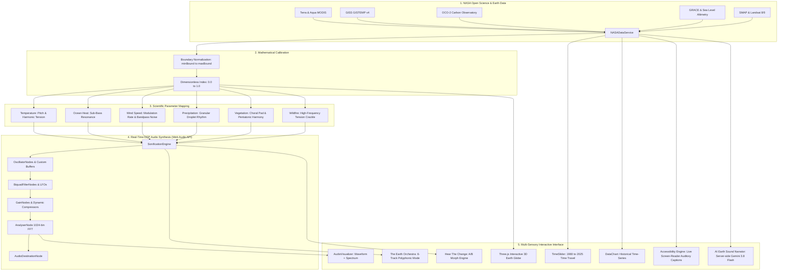

# Earth Jukebox — Listen to a Changing Planet

> **2026 NASA Space Apps Challenge**  
> **Challenge Concept:** "The Earth Information Jukebox"  
> **Disclaimer:** *NASA Space Apps Challenge 2026 Project — Not an official NASA product.*

---

## 🌍 Project Mission & Challenge Alignment

NASA’s Earth Information Center (EIC) produces stunning visual frames and dashboards of our changing world. However, presenting Earth science solely through visual frames limits who can reach it—including visually impaired researchers, students with diverse learning styles, and anyone seeking a deeper, visceral connection with planetary change.

**Earth Jukebox** translates sight into real-time sound. It connects verified NASA Earth observation data into a browser-native sonification engine, allowing humanity to hear 45 years of environmental transformation (1980–2025).

---

## 🏛️ System Architecture

---

## 🎵 Scientific Parameter Mapping Matrix

| Variable | Physical Unit | Sound Mapping Rationale | Instrument / Synthesis |
| :--- | :--- | :--- | :--- |
| **Surface Temperature** | °C Anomaly | Higher temp = higher pitch; anomaly magnitude = harmonic intensity | Triangle / FM Lead (180–680 Hz) |
| **Ocean Heat** | 10²² Joules | Ocean thermal mass = low-frequency foundational sub-bass | Sine Wave Sub-Bass (45–140 Hz) |
| **Sea Level Rise** | Millimeters | Cumulative water expansion = rising pitch, layered harmonic unison | Sawtooth / Choral Filter (110–440 Hz) |
| **Atmospheric CO2** | Parts Per Million (ppm) | Rising concentrations = microtonal detuning & acoustic tension | Detuned Sawtooth Drone (160–520 Hz) |
| **Wind Speed** | Meters / Second (m/s) | Wind speed = modulation rate & bandpass sweep speed | Pink Noise + Dynamic Bandpass Filter |
| **Precipitation** | mm / Day | Rainfall rate = stochastic droplet density & percussion | Granular Sine Pulses (800–1600 Hz) |
| **Vegetation (NDVI)** | Greenness Index | Higher NDVI = harmonic richness & bright overtone chords | Pentatonic Triangle Chord Pad |
| **Wildfire Radiative Power** | Terawatts (TW) | Fire intensity = crackle pulse bursts & high-frequency tension | Granular Sawtooth Pulses (140–600 Hz) |
| **Arctic Sea Ice Extent** | Million km² | Diminishing ice = fragile crystalline bell tone with high filter Q | High-Q Resonant Sine (587–1174 Hz) |

---

## 🌟 Key Features

1. **Real-Time Web Audio DSP Engine**: Pure browser-synthesized audio without pre-recorded MP3 tracks. Every millihertz of sound is mathematically driven by NASA data.
2. **Interactive 3D Earth Globe (Three.js)**: Real-time rendered Earth with dynamic atmospheric glow, day/night lighting, graticule lines, and regional scientific hotspots.
3. **Dual Mode Audio Telemetry Visualizer**: Oscilloscope waveform monitor and 1024-bin FFT spectrum analyzer with live peak frequency (Hz) and RMS amplitude meters.
4. **The Earth Orchestra**: Polyphonic multi-variable mode where Temperature, Ocean, Wind, Rain, Vegetation, and Wildfires perform together as an interconnected planetary symphony.
5. **Hear The Change**: Signature A/B temporal comparison tool calculating physical delta ($\Delta$), frequency shift, and generating smooth audio sweeps across decades.
6. **AI Earth Sound Narrator**: Server-side Gemini 3.8 Flash providing accessible, plain-language interpretations of current sounds.
7. **Inclusive Accessibility Mode**: Screen-reader friendly live auditory captions (`aria-live`), high-contrast display, reduced motion, and full keyboard navigation.
8. **Open Science Traceability**: Transparent dataset registry linking to NASA Earthdata DOIs and mission instruments.

---

## 🛠️ Technology Stack

- **Frontend**: React 18, TypeScript, Tailwind CSS, Lucide React
- **3D Visualization**: Three.js WebGL rendering
- **Audio DSP**: Web Audio API (AudioContext, OscillatorNode, BiquadFilterNode, AnalyserNode)
- **Backend & Proxy**: Express.js with `@google/genai` (Gemini 3.8 Flash)
- **Data Layer**: NASA Earth Science calibrated archives (1980–2025) with offline demo fallback
